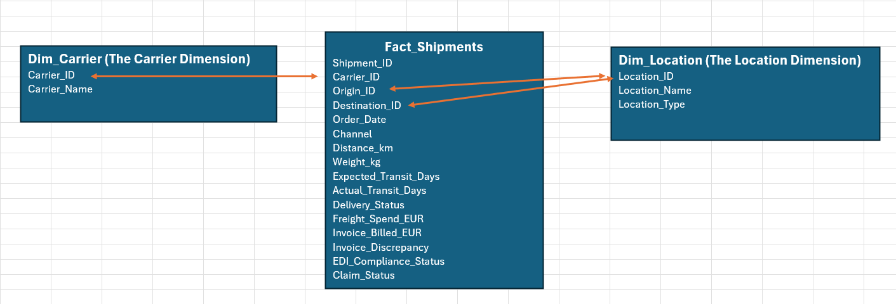

# Optimizing EMEA Logistics: Reducing Transit Delays and Carrier Overbilling

🔗 **[View the Interactive Tableau Dashboard Here](https://public.tableau.com/app/profile/naser.mahmood/viz/EMEA_Supply_Chain_Optimization/EMEA_Supply_Chain_Optimization?publish=yes)**

## 📌 Executive Summary
In this project, I acted as a Supply Chain Data Analyst for an EMEA retail network. The goal was to audit third-party logistics (3PL) performance, identify root causes for transit delays, and flag carrier overbilling. 

By engineering a realistic supply chain dataset and building an end-to-end SQL and Tableau pipeline, I identified **critical SLA failures in the DPD Local and DHL Express networks**, flagged **€23,000+ in systemic 3PL overbilling**, and isolated severe routing bottlenecks originating from the UK Distribution Center.

## 💼 Business Problem
The EMEA logistics network relies heavily on cross-functional carrier coordination to supply retail stores and e-commerce customers. The business was facing three core challenges:
1. Lack of visibility into which 3PL partners were consistently missing On-Time Delivery SLAs.
2. Unaudited invoice discrepancies leading to inflated freight spend.
3. Hidden routing bottlenecks causing downstream inventory shortages.

## 🛠️ The Tech Stack
* **Python:** Used to generate a highly realistic, 50,000-row synthetic dataset mirroring live EMEA retail logistics.
* **MySQL:** Data cleaning, standardization, deduplication, and Exploratory Data Analysis (EDA).
* **Tableau:** Executive dashboard design and data storytelling.
* **Excel:** Documentation (Data Dictionary and Entity Relationship Diagram).

---

## 🗄️ Data Architecture & Documentation

To ensure scalability, the flat file was modeled into a Star Schema with a central Fact table (`Fact_Shipments`) and supporting Dimension tables for locations and carriers. 



### Data Dictionary
| Column Name | Data Type | Description |
| :--- | :--- | :--- |
| `Shipment_ID` | VARCHAR | Unique alphanumeric identifier for each shipment. |
| `Order_Date` | DATE | Standardized date of shipment order. |
| `Origin_Location` | VARCHAR | Starting distribution center (e.g., DC_London_UK). |
| `Carrier_3PL` | VARCHAR | Assigned logistics vendor. |
| `Distance_km` | INT | Total transit distance in kilometers. |
| `Weight_kg` | DECIMAL | Total weight of the shipment. |
| `Expected_Transit_Days` | INT | SLA target for transit time. |
| `Actual_Transit_Days` | INT | Real transit time realized. |
| `Delivery_Status` | VARCHAR | Flag indicating 'On_Time' or 'Late'. |
| `Freight_Spend_EUR` | DECIMAL | Expected system transport cost. |
| `Invoice_Billed_EUR` | DECIMAL | Actual amount billed by the carrier. |
| `Invoice_Discrepancy` | DECIMAL | Monetary difference between expected and billed costs. |

---

## 🧹 Data Cleaning (MySQL)
Real-world data is messy. I intentionally engineered the raw data to include missing values, mixed regional date formats, negative financial figures, and duplicate EDI scans. 

I wrote a comprehensive SQL script to normalize this data for Tableau. Key transformations included:
* **Date Normalization:** Bypassed MySQL Strict Mode using a `CASE WHEN` pattern match to standardize mixed EU, US, and ISO date strings.
* **Deduplication:** Utilized Window Functions (`ROW_NUMBER() OVER`) within a CTE to identify and filter out duplicate shipment scans.
* **Imputation:** Used `COALESCE` and `NULLIF` to handle missing cargo weights by imputing a baseline average.
* **Standardization:** Cleaned categorical typos using `TRIM()` and `CASE` statements to ensure accurate vendor grouping.


<details>
<summary><strong>🚨 💻 CLICK HERE TO VIEW THE DATA CLEANING SQL SCRIPT 🚨</strong></summary>
 
```sql
CREATE TABLE clean_shipments AS
WITH deduplicated_raw AS (
    SELECT 
        *,
        ROW_NUMBER() OVER(PARTITION BY Shipment_ID ORDER BY Order_Date DESC) as row_num
    FROM raw_shipments
)
SELECT 
    Shipment_ID,
    CASE 
        WHEN Order_Date LIKE '20__-__-__' THEN STR_TO_DATE(Order_Date, '%Y-%m-%d')
        WHEN Order_Date LIKE '%/%/%' THEN STR_TO_DATE(Order_Date, '%d/%m/%Y')
        WHEN Order_Date LIKE '__-__-20__' THEN STR_TO_DATE(Order_Date, '%m-%d-%Y')
        ELSE NULL 
    END AS Order_Date,
    CASE 
        WHEN Origin_Location = 'London DC' THEN 'DC_London_UK'
        WHEN Origin_Location = 'Frankfurt_Warehouse' THEN 'DC_Frankfurt_DE'
        ELSE Origin_Location 
    END AS Origin_Location,
    Destination,
    Channel,
    CASE 
        WHEN TRIM(Carrier_3PL) = 'dhl express' THEN 'DHL_Express'
        WHEN TRIM(Carrier_3PL) = 'DPD-Local' THEN 'DPD_Local'
        WHEN Carrier_3PL IS NULL OR Carrier_3PL = '' THEN 'Unknown_Carrier'
        ELSE TRIM(Carrier_3PL)
    END AS Carrier_3PL,
    ABS(Distance_km) AS Distance_km,
    ROUND(COALESCE(NULLIF(Weight_kg, ''), 150.00), 2) AS Weight_kg, 
    Expected_Transit_Days,
    Actual_Transit_Days,
    Delivery_Status,
    ABS(Freight_Spend_EUR) AS Freight_Spend_EUR,
    ABS(Invoice_Billed_EUR) AS Invoice_Billed_EUR,
    EDI_Compliance_Status,
    Claim_Status,
    ROUND((ABS(Invoice_Billed_EUR) - ABS(Freight_Spend_EUR)), 2) AS Invoice_Discrepancy
FROM deduplicated_raw
WHERE row_num = 1;

```
</details>


### 🔎 Data Validation (Python Sanity Checks)
After engineering the synthetic dataset, I ran `df.describe()` to validate the statistical distribution of the continuous variables before exporting. This step ensured the data met physical logistics constraints (e.g., clipping the minimum weight so no negative values were generated) and accurately reflected the targeted 150 kg LTL (Less-than-Truckload) mean.

| Statistic | Weight_kg | Distance_km |
| :--- | :--- | :--- |
| **count** | 48500.00 | 50000.00 |
| **mean** | 150.15 | 1229.73 |
| **std** | 30.07 | 702.27 |
| **min** | 22.50 | 15.01 |
| **25%** | 129.97 | 621.10 |
| **50%** | 150.23 | 1229.80 |
| **75%** | 170.42 | 1837.11 |
| **max** | 264.89 | 2449.93 |

> *Note: The `Weight_kg` count is intentionally lower than 50,000 due to the deliberate injection of missing values to simulate real-world sensor failures, which were later resolved using SQL mean imputation.*


## 📈 Exploratory Data Analysis & Business Insights

### 1. Carrier SLA Failures
* **Insight:** DPD Local and DHL Express are severely underperforming, with nearly 40% of their shipments arriving late. Conversely, XPO Logistics and FedEx maintain near-perfect SLA compliance.
* **Recommendation:** Reroute standard parcel volume away from DPD Local to FedEx Crossborder, and initiate a vendor performance review with DHL account managers.

### 2. Invoice Discrepancies (Overbilling)
* **Insight:** Maersk Inland and XPO Logistics are responsible for the highest amounts of invoice discrepancies, heavily inflating operational freight spend.
* **Recommendation:** Implement an automated freight audit and payment (FAP) system rule to flag any Maersk or XPO invoice with a variance greater than 3% for manual review before payout.

### 3. Route Bottlenecks
* **Insight:** The route from `DC_London_UK` to `Store_Berlin` is the least efficient node in the EMEA network, averaging over 2.5 days of delay per shipment.
* **Recommendation:** Investigate customs clearance procedures post-Brexit for the UK-to-Germany lane, and consider fulfilling Berlin store inventory directly from the Frankfurt DC instead of London.

---

## 🚧 Limitations & Next Steps
* **Data Limitations:** This analysis assumes static SLA targets based on raw distance. In reality, transit targets vary by seasonal volume, truck capacity, and specific vendor contracts.
* **Next Steps:** If given access to warehouse operating hours, I would perform a cohort analysis to see if specific days of the week (e.g., Friday dispatches) are driving the delays on the London-to-Berlin lane.

## Step 2: Monthly Cohort & Carrier Remediation Analysis

Following the initial optimization, we extracted a comprehensive 2023 dataset (clean_shipments_final.csv) containing 50,500 EMEA and cross-border shipments to evaluate vendor performance and financial compliance over time. By cohorting the data by month and carrier, we bypassed surface-level metrics to uncover severe systemic failures in the logistics network.

### 🔍 Key Findings from the Data

1. **Critical SLA Breaches by Tier-1 Carriers:** 
   Our carrier performance cohort analysis revealed a catastrophic failure in our routing guide. Three primary 3PLs—**FedEx Crossborder, Maersk Inland, and XPO Logistics**—yielded a **0% On-Time Delivery rate** across the entire year. Their actual transit days averaged 6-7 days against an expected SLA of 3.8 days. DPD-Local and DHL Express performed better, but still only achieved an unacceptable ~40% On-Time rate. Overall network OTIF (On-Time In-Full) hovered at a stagnant 16% month-over-month.
2. **Massive Financial Bleed (Freight Audit Failure):** 
   By cross-referencing `Freight_Spend_EUR` against `Invoice_Billed_EUR`, the data exposed severe invoice discrepancies. Across 2023, the total financial leakage amounted to **€6.15 Million**. Every major carrier is consistently overbilling by an average of €115 to €128 per shipment. 
3. **Alarming Claim Rates:** 
   **42.2%** of all shipments resulted in a claim (amounting to 21,304 individual claims). These failures are split almost evenly across *Lost Freight* (33%), *Shortages* (33%), and *Damaged in Transit* (34%). 

### 🚀 Realistic Conclusions & Final Actionable Results

The lack of month-over-month operational improvement indicates a broken feedback loop between the logistics control tower and our 3PL vendors. Based on this data, the following strategic actions must be executed immediately:

* **Action 1: Carrier Remediation & Volume Shifting:** Place FedEx, Maersk, and XPO on immediate 60-day probation. Temporarily re-route high-priority `B2B_Wholesale` and `Retail_Store` volume to DPD and DHL. If the probationary carriers cannot bring actual transit days within +1 of expected SLAs, initiate offboarding.
* **Action 2: Deploy Automated Freight Audit & Pay (FAP):** The €6.15M in overbilling is unacceptable. We must halt all manual invoice approvals. Implement an automated EDI compliance gate that immediately flags and rejects any invoice where `Invoice_Billed_EUR` > `Freight_Spend_EUR`.
* **Action 3: Shift Root-Cause Focus to Origin Warehouses:** Because claim types (Damage/Loss/Shortage) are uniformly distributed across all carriers rather than isolated to one bad vendor, the root cause is likely occurring *before* transit. We must audit our origin facilities (specifically `US_Home_Office_NY` and `Vendor_Rotterdam_NL`) for substandard palletization and packaging protocols.
